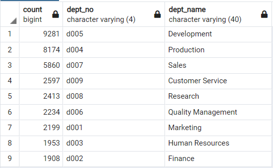
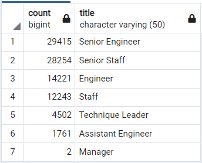
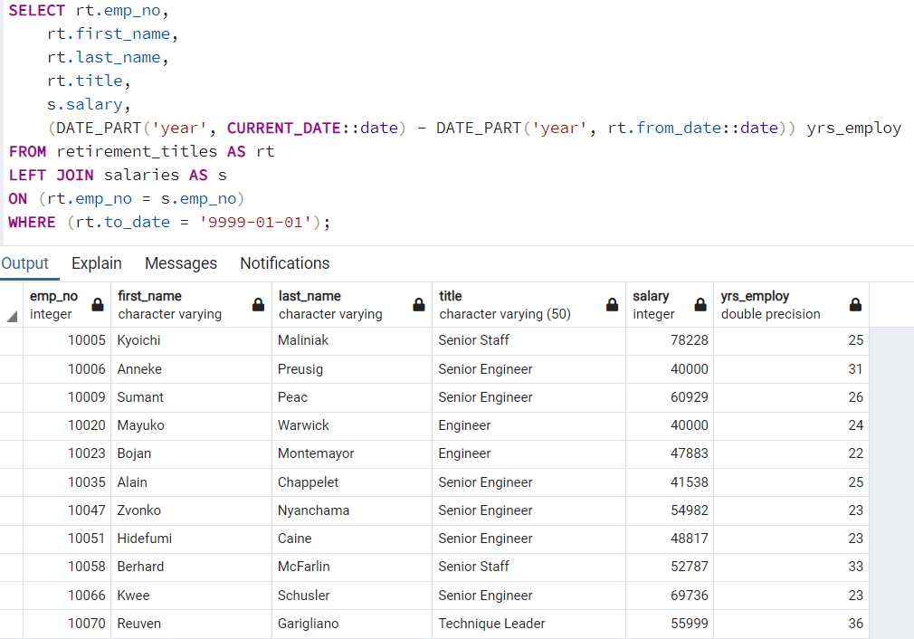
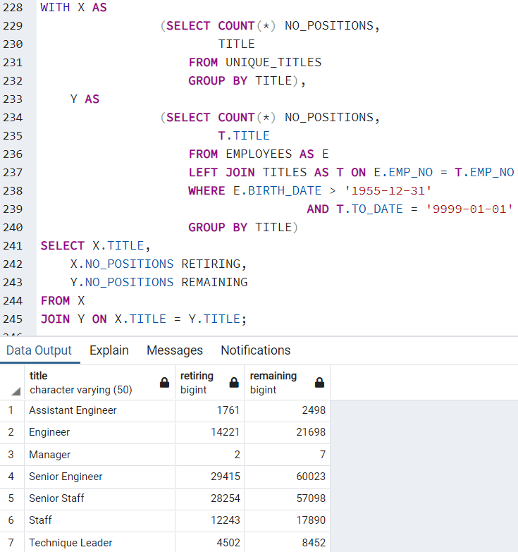

# Pewlett-Hackard-Analysis

## Project Overview
Build an employee database with SQL for Pewlett Hackard. Also, determine the which employees are eligible for the retirement package and determine the amount of positions needed to be filled.

## Results
1. Over 90,000 Pewlett Hackard are eligible for retirement.
2. Development and Production departments have the most employees eligible for retirement.  
  
3. Majority of the retiring employees are Senior Engineers and Senior Staff members.  
  
4. Two department managers are also eligible for retirement.

## Summary
A table can be created to display the retiring employees' years of employment, current salaries, and titles. This could help determine the retirment package amount of each.  
  
  
Another table that would be beneficial is a comparison of the number of retiring employees versus the number of remaining employees within each job field. 
  

- *How many roles will need to be filled as the "silver tsunami" begins to make an impact?*  
From the data, over 90,000 employess are eligible for retirement. However, that is dependent on the individual want to retire and if the department needs to backfill the position. The data shows nearly a third of the workforce are retirment-ready employees and would significantly impact the business.

- *Are there enough qualified, retirement-ready employees in the departments to mentor the next generation of Pewlett Hackard employees?*  
 The mentorship eligiblity table has a count of 1,549 employees. With amount of retirement-ready employees, Pewlett Hackard would have more than enough for the mentorship program.